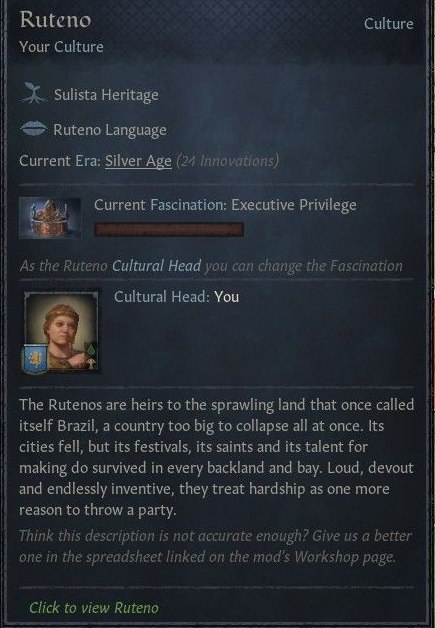
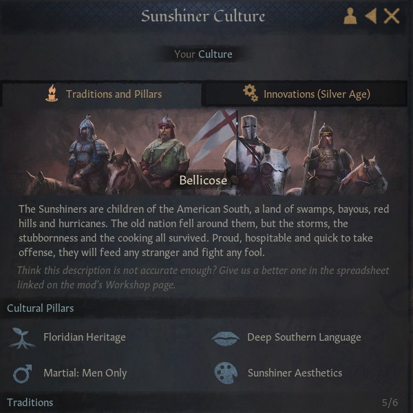

# After the End: Culture Descriptions

A submod for **[After the End](https://steamcommunity.com/sharedfiles/filedetails/?id=3192256710)** (Crusader Kings III 1.19) that gives every culture a short narrative description, the way faiths already have one.

Hover over any culture, anywhere in the game (a character, a county, the cultures map mode), and the tooltip tells you who they are, where they came from and what makes them tick. Open the culture window and the same description is right under the ethos banner.

<p align="center">
  
  &nbsp;
  
</p>

**Steam Workshop:** https://steamcommunity.com/sharedfiles/filedetails/?id=3809203832

## Features

- **A description in every culture tooltip.** It appears below the usual content and never stretches the tooltip.
- **Also in the culture window**, right under the ethos banner of the Traditions and Pillars tab. Pillars and traditions stay where they were.
- **No culture is ever left blank.** ATE has 422 cultures. Those without a written description get a generic one based on their region: the South, the Caribbean, the Andes, the Arctic and so on.
- **New cultures included.** Hybrid and divergent cultures created during the game, by you or by the AI, get a description that fits how they were born.
- **Written descriptions win.** When a culture gets its own text, it replaces the generic one automatically, even in saved games.
- **Safe for existing saves.** You can add the mod to a running campaign: every culture gets its description by the next January 1st.
- **Write your own.** When you create a hybrid or divergent culture, you can write its description yourself: it replaces the generic one. As cultural head you can rewrite it at any time, as often as you like, with the **Edit Description** button of the culture window. Your text stays after your death, and your heir can edit it.
- **Community-driven.** The culture window invites you to write a better description (see below). The tooltip stays clean.

## Help write the descriptions

There are 422 cultures in After the End, and each deserves someone who actually loves it. The descriptions are being written by the community in a shared spreadsheet:

**👉 [After the End culture descriptions (Google Sheets)](https://docs.google.com/spreadsheets/d/1l1CXGpG0bm9sCHKsWecNKvg0Pni-3jLZ94Ml3ykzkDM/edit)**

1. Find your favorite culture. They are grouped by region and heritage.
2. Write its description in the **Description** column.
3. Put your name in **Written by** to get credit.

**Rules:**

- English, **2 to 4 sentences**. It has to fit in a tooltip.
- Keep the ATE flavor: post-apocalyptic America, where the institutions of the old world turned into myths.
- No line breaks, and no `[ ]`, `$` or `#` characters (the game reads them as code).
- In the **Generic descriptions** tab, write `{culture}` wherever the name of the new culture should go.
- Don't edit or delete other people's entries.

## Requirements and compatibility

- **Crusader Kings III 1.19** and **After the End**. Load this mod **after** After the End.
- The mod replaces two vanilla interface files to show the description:
  - `gui/shared/cooltip.gui` (the shared tooltip file);
  - `gui/window_culture.gui` (the culture window).

  It is **incompatible with other mods that change either file**: whichever loads last wins. After the End itself touches neither. Both files are unmodified vanilla copies except for the blocks marked `#ATE_CD ADDITION` (one in the tooltip, two in the culture window: the description and the Edit Description button), which makes a compatibility patch easy.
- It raises the engine's limit for typed text (`NGUI.RENAME_MAX_LENGTH`, vanilla 40 characters) to 500, so a description fits. Every rename box in the game keeps its own character cap, so names do not get longer in practice. Advanced Cheat Menu sets 1000: either value works.
- Game mechanics are untouched: no changes to cultures, traditions, hybridization or divergence.

## How it works

For anyone curious, or anyone writing a compatibility patch:

- Each culture stores its description key in a **culture variable** (`ate_cd_culture_key`). The tooltip turns it into a localization key and shows that text. Because the key lives in the culture and not in its name, the description survives renames and is saved with the game. The technique comes from **[Elder Kings 2](https://steamcommunity.com/sharedfiles/filedetails/?id=2887120253)**.
- **Written descriptions** are registered at game start and again on every `yearly_global_pulse`, so saved games pick up descriptions added in later versions.
- **Generic descriptions:** ATE's 106 heritages are grouped into **15 regional families**. Each family has three texts:
  - **base**, for an original ATE culture without its own text;
  - **hybrid**, for a culture born from blending two cultures;
  - **divergent**, for a culture that broke away from its parent.

  New cultures get theirs through `on_culture_created`.
- A culture with no family (for example, one from another mod) shows a **universal fallback** text.
- What to show lives in **one shared interface component** (`ate_cd_culture_description`), used by both the tooltip and the culture window.
- **Player-written descriptions:** CK3 can only store free text on characters, so the text is saved on its author (and kept after their death) and the culture points at them. The engine writes the text with any option of the event and refuses empty text or the characters `[ ] $ #`, so the field always starts filled in. A character can hold only one text, so when you write for a new culture (for example after diverging), the culture you described before keeps its text through its current head, or goes back to its generic description.

| Family | Heritages |
|---|---|
| Southern US | Floridian, Deep South, Old Southern, Louisianais, Geechee, Upland, Texan |
| Northeast & Great Lakes | Mid-Atlantic, Yankee, Lakelander, Midwestern, Northlake, Amish, Mennonite, Shtetl |
| Western US | Californian, Frontieran, Rockland, Transcascadian |
| Canada | Canayen, Laurentian, Atlantic Canadian, Prairie |
| Native peoples of the East & the Plains | Plains, Sioux, Sequoyan, Anishinaabe, Wabanaki, Longhouse, Lumbee, Seminole |
| Native peoples of the West & the Pacific | Plateau, Great Basin, Interior, Columbian, Lower Coast, Upper Coast, Native Californian |
| North & Arctic | Arctic, Dene, Boreal, East-Cree, Peninsular, Spitsberger |
| Mexico | Normexa, Centromexa, Sudmexa, Mexonite |
| Native Mesoamerica | Mesoamerican, Maya, Tehuantepec, Aridomex |
| Central America | Centroamericano, Honduran, Panamanian, Mesocreole |
| Caribbean & the Guianas | Greater Antillean, Lesser Antillean, Guyanan, Maroon, Cayennais, Native Guyanan |
| Andes & northern South America | Colombian, Native Colombian, Venezuelan, Llanero, Ecuatoriano, Andino, Bajo Peruano, Nazco, Boliviano |
| Brazil | Cabano, Café com Leite, Costeiro, Geraizeiro, Manguetowner, North-Sertanejo, West-Sertanejo, Paulistânico, Serra do Mar, Sulista, Cíclico |
| Amazonia & native Brazil | South-Amazonian, Upper-Amazonian, Japurá-Negro, Madeira-Tapajós, Roraiman, Tupian, Selvático, Orinocoan, Northern Jê, A'uwê Jê, Southern Jê, Cariri |
| Southern Cone | Chileno, Gaucho, Platense, Viejispano, Patagonian, Austral, Mapuche, Islander, Guaraní, Chacoan, Guaicurú |

## For other mods: add a description for your own culture

If your mod adds cultures to After the End, it can give them a description that this mod shows in the tooltip and the culture window. It takes three small files in your mod (a localization key, an effect that sets a culture variable, and an on_action) and it is a soft dependency: without this mod installed, nothing breaks.

**Step-by-step guide: [FOR_MOD_AUTHORS.md](FOR_MOD_AUTHORS.md).** Working example: the Neomoor culture of the *Neomoor Culture Revival* mod.

## Project layout

```
common/
  defines/            raises the engine's limit for typed text
  on_action/          game start, yearly pulse and culture creation hooks
  scripted_effects/   key assignment; *_generated.txt files are generated, do not edit by hand
  scripted_guis/      the Edit Description button
  script_values/      tells the interface what to show (own text, key or fallback)
events/               the event where the player writes the description
gui/
  ate_cd_culture_description.gui   the shared description component (tooltip + window)
  event_window_widgets/            the multiline text box of that event
  shared/cooltip.gui               vanilla tooltip file + the block marked #ATE_CD ADDITION
  window_culture.gui               vanilla culture window + two blocks marked #ATE_CD ADDITION
localization/english/    descriptions (per heritage), generics and the fallback
prds/, plans/            design documents (in Spanish)
docs/                    screenshots
```

All `.txt`, `.yml` and `.gui` files are UTF-8 **with BOM** and use real tab characters, as CK3 requires. `.gitattributes` disables line-ending conversion so the files stay byte-identical.

## Changelog

**0.2.1**
- New community descriptions: Michigander, Buckeye, Gothamite, Yiddish, and six Californian cultures: Bayfolk, Jeffersonian, Joaquino, Montereyan, Socaleno and Valleyan.

**0.2.0**
- Write your own culture's description: an event when you create a hybrid or divergent culture, and an **Edit Description** button in the culture window (culture head only, unlimited edits).
- The invitation to improve a description now appears only in the culture window, not in every tooltip.
- The engine's limit for typed text (`NGUI.RENAME_MAX_LENGTH`) is raised from 40 to 500.
- First community descriptions: Barriga Verde, Hunsrickisch and Ancient Portuguese.

**0.1.0**
- First release: descriptions in the culture tooltip and the culture window, 45 regional generic texts, and the community spreadsheet.

## Credits

- **After the End** team, for the world these cultures live in.
- **Elder Kings 2** team, for the culture-description technique.
- **Description writers:** u/Reasonable_Common_46 (Barriga Verde, Hunsrickisch), u/breathingrequirement (Ancient Portuguese), PepsiManIII (Michigander), NotATem (Buckeye), u/Pipsy_the_Penguin (Gothamite) and u/RedHuron (Bayfolk, Jeffersonian, Joaquino, Montereyan, Socaleno, Valleyan).
- Every community member who writes a description: your name goes in the credits.
